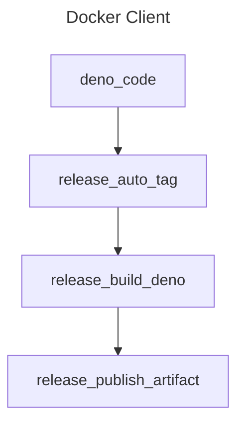

<!-- markdownlint-disable MD041 -->
<!-- markdownlint-disable MD012 -->

# deno

Repo Template for Deno

## Binary Distribution

### Supported Platforms

> [!IMPORTANT]
>
> The following platforms are *currently* supported:

* darwin
  * amd64
  * arm64
* linux
  * amd64
  * arm64
* windows
  * amd64
  * -arm64- (unsupported)

## Index

| Command | Purpose |
| -- | -- |
| name |  Creates a thing |
| default | Does another thing |

<!-- github feature -->
<!-- markdownlint-disable MD033 -->

  
Detailed Information

    ## Hide me

    Lots of details

# Logical Diagram

<!-- github feature -->
<!-- markdownlint-disable MD046 -->

